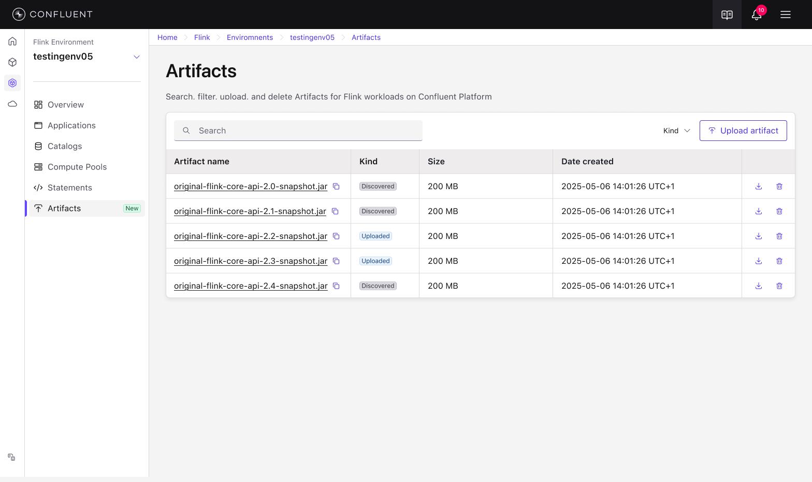

# Artifact Management Project Images

## Image Inventory

1. **artifact-list.png** - Main artifact listing page
2. **artifact-list-filtered.png** - Artifact list with applied filters
3. **empty-state-not-configured.png** - Empty state when feature not configured
4. **empty-state-configured.png** - Empty state when configured but no artifacts uploaded
5. **environment-details.png** - Environment details view
6. **environment-listing.png** - Listing page of all Flink environments
7. **upload-notification.png** - Success notification after upload
8. **upload-panel.png** - Upload slide panel - initial state
9. **upload-panel-1.png** - Upload panel - variant 1
10. **upload-panel-2.png** - Upload panel - variant 2
11. **upload-error-character-limit.png** - Error when filename exceeds character limit
12. **upload-errors-multiple.png** - Multiple validation errors during upload

## Usage in HTML

```html

```

## Naming Convention

- **Lowercase with hyphens** (not spaces or underscores)
- **Descriptive and concise** names
- **Grouped by feature** (e.g., all upload-related images start with "upload-")
